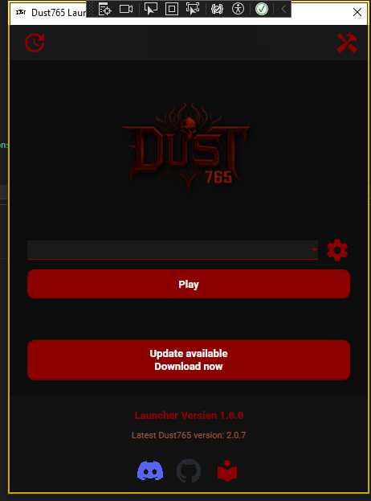

# Dust765.4 Launcher

Official launcher for Dust to run the game client.

## Installation

Download the [latest release](https://github.com/bittiez/TUO-Launcher/releases), unzip the file and run `Dust765.4 Launcher.exe`.

## Community

Join our Discord for support, updates and news:

